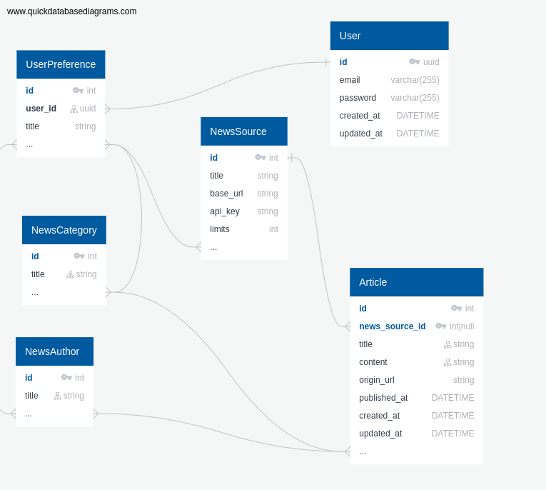

## About Project

Challenge task.
Create API for News Aggregator.

## DISCLAIMER

This project is a personal pet project created solely for educational and study purposes.

The code provided in this repository is not intended for production or commercial use.
Users are advised that the code may contain incomplete implementations, unoptimized features,
or potential security vulnerabilities that have not been addressed.

Important Note: Any use of this code for production, commercial, or any critical purpose is
strictly discouraged. The author accepts no responsibility for any issues or damages arising
from the use of this code outside of its intended study and learning scope.

By accessing or using any part of this project, you agree to use it solely for non-commercial,
educational purposes and acknowledge that it is provided "as is" without any warranties or
guarantees of functionality or safety.

Thank you for understanding!

## Installation

you can find all needed commands in the `Makefile`.

Required:
1. be sure that you have `.env` file. you can copy and edit `.env.example`
2. just run `make install`

Set you SECRET API keys for news sources. Do not worry, you can do it later on news source creation. Or you can edit them manually in DB.

Optional:
1. seed database `make db-seed`
2. use commands to create data manually:
   1. `app:news-author:add {full_name} {slug?}`
   2. `app:news-category:add {title} {slug?}`
   3. `app:news-source:add {title} {base_url} {apikey} {slug?}`

## Documentation

On you local environment you can find all needed documentation.
http://localhost:8090/api/docs#/

### Queue
On prod and dev you can have tools to run multiple queues in the background.

On this local environment version you should run each queue in a separate console tab.
Be sure to run:
* `make run-schedule-worker`
* `make run-fetching-worker`
* `make run-storing-worker`

## Entrypoints
* Home http://localhost:8090
* API Documentation http://localhost:8090/api/docs
* Debugger http://localhost:8090/telescope/requests

## Database

## Issues

### Permissions with Sail

`If you have a problem accessing or editing some parts of the project.`

Temp fix
* In WSL2 jump into the docker container as root by running this command vendor/bin/sail root-shell.
* Move up one directory cd...
* Recursively change the owner and group of the html folder to sail chown -R sail:sail html .
* Confirm the change ls -la. You should see the group and user sail on all the files and folders.
* Exit the container exit.

## Tools & Packages
* [zircote/swagger-php](https://zircote.github.io/swagger-php/guide/installation.html)
* [laravel-swagger-ui](https://github.com/wotzebra/laravel-swagger-ui)
* [docker swagger ui swaggerapi/swagger-ui](https://hub.docker.com/r/swaggerapi/swagger-ui)
